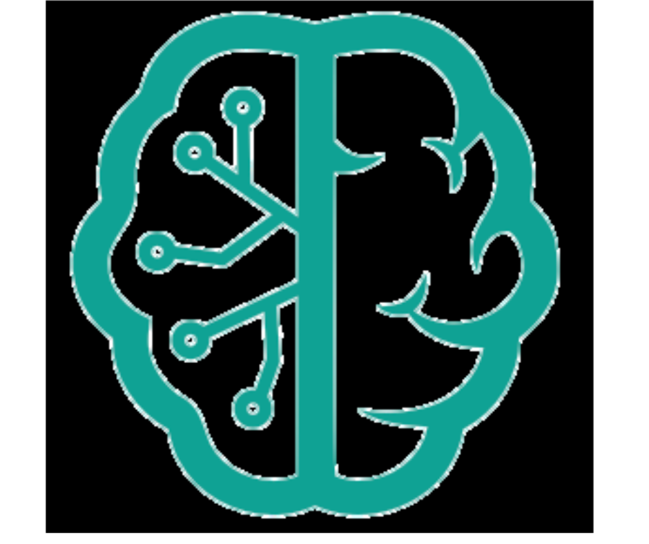

## Introduction to neurons.me

Welcome to neurons.me, a versatile and modular framework designed for the creation and management of neural network components. This framework serves as a cornerstone for building decentralized neural networks, offering developers the ability to define and orchestrate artificial neurons, neural networks, and layers with extensive customization options in JavaScript.

## Development Status

**In Active Development and Exploration**: neurons.me is currently in the experimental phase, with its features and core functionalities under continuous refinement. Given its developmental nature, aspects of the framework are subject to change. However, the foundational vision and its operational relationship with the all.this library remain steadfast, aiming to provide a robust platform for neural network development and integration.

## Vision and Connection with all.this

neurons.me is envisioned to seamlessly integrate with the all.this library, establishing a symbiotic relationship where neurons.me enhances the data structuring and processing capabilities of all.this with advanced neural network functionalities. This integration aims to:

- **Enhance Data Processing**: Leverage neurons.me within the all.this ecosystem to process and analyze structured data using advanced neural network models, enriching the data insights and interactions within the all.this framework.
- **Modular Neural Components**: Facilitate the creation of modular and customizable neural components in all.this, allowing for sophisticated neural network architectures that can evolve and adapt within the decentralized networks fostered by all.this.
- **Unified Framework**: Create a cohesive environment where neural networks and structured data coexist, enabling developers to harness the combined power of structured data management and neural computation.

## Installation

Integrate neurons.me into your project with ease:

```bash
npm i neurons.me
```

## Basic Usage and all.this Integration

Begin using neurons.me and explore its integration with all.this:

```javascript
const neurons = require('neurons.me');

// Define neuron properties
let neuronOptions = {
  weights: [0.5, 0.3, 0.2],
  bias: 0.1,
  activationFunction: x => x * 2,
};

// Create and organize neurons into layers
let layer = new neurons.Layer();
let neuron = neurons.createNeuron(neuronOptions);
layer.addNeuron(neuron);

// Assemble neural networks and integrate with all.this data structures
let neuralNetwork = new neurons.NeuralNetwork();
neuralNetwork.addLayer(layer);

// Utilize the neural network within the all.this ecosystem for enhanced data processing and analysis
```

## Looking Forward

As we continue to develop neurons.me, our goal is to establish a transparent, adaptive, and impactful framework that not only stands on its own in the realm of neural network development but also complements and extends the functionalities within the all.this library. Stay connected for future updates and enhancements.

Engage with us, contribute, or raise issues as we collectively shape neurons.me to be an integral part of the neural network and data processing communities within the all.this ecosystem.



## License & Policies
- **License**: MIT License (see LICENSE for details).
- **Privacy Policy**: Respects user privacy; no collection/storage of personal data.
- **Terms of Usage**: Use responsibly. No guarantees/warranties provided. [Terms](https://www.neurons.me/terms-of-use) | [Privacy](https://www.neurons.me/privacy-policy)

## Contributing, Feedback and Contact
We're always interested in hearing about your experiences with our package. If you have any suggestions for improvements, or if you've created something cool with our package, we'd love to hear from you!
You can get in touch with us in the following ways:
Email: admin@neurons.me
Instagram: @jabella.e
We're also interested in understanding how our package is being used. If you're willing to share, please take a moment to reach over.

Please note that your privacy is very important to us. Any information you provide will be kept confidential and will be used solely to help us improve our package.

**Happy Coding!**

